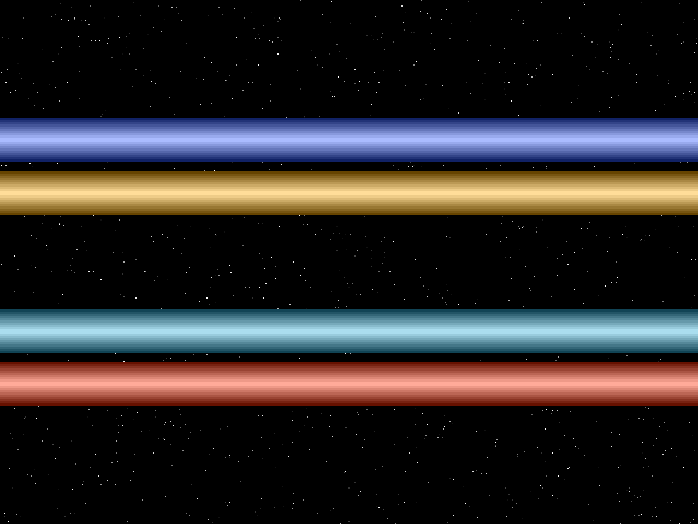

# PYNQ-Z2 FPGA and firmware HDMI demo project

Built using the Xilinx toolchain/toolsuite.  
Should also be portable to other ZYNQ XC7Z020 compatible boards.

## Purpose

What does it do?  
creates a starfield and raster bar 'playfield' and overlays the raster bars on the starfield

Start by reading the project [documentation](./docs/docs.md)

```sh
git clone...
./create
```

